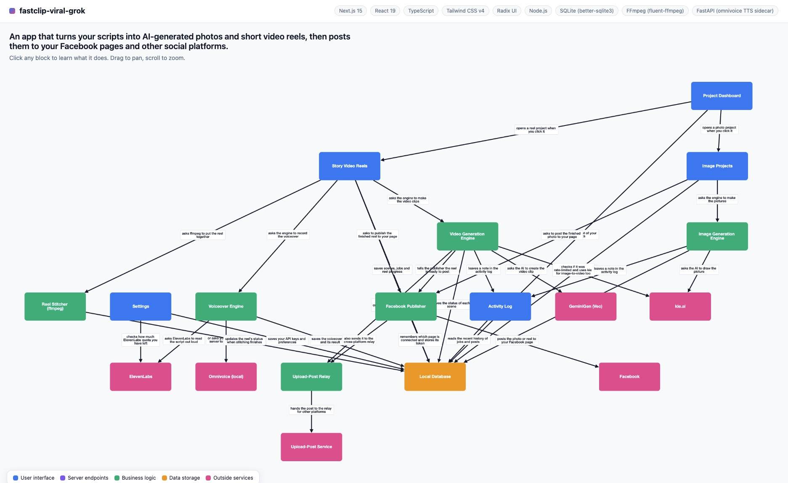

# 📦 BoxBox

> by **[AI UNLOCKED](https://github.com/aiunlocked1412)**

[](https://github.com/aiunlocked1412/boxbox)
[](https://github.com/aiunlocked1412/boxbox/stargazers)
[](https://github.com/aiunlocked1412/boxbox/network/members)
[](https://opensource.org/licenses/MIT)
[](https://docs.claude.com/en/docs/claude-code)
[](https://github.com/aiunlocked1412)
[](https://www.facebook.com/aiunlockedvip)

🌐 **Language / ภาษา:** **English** · [ไทย](./README.th.md)

---

**See your codebase as a friendly, zoomable picture.**

⭐ **If BoxBox helps you understand your code, please [star the repo](https://github.com/aiunlocked1412/boxbox) — it really helps others discover it!**



> *A real BoxBox diagram of an AI video/photo generator app — every block clickable, every connection in plain English.*

**BoxBox** is a Claude Code plugin for **non-coders who use AI to build apps**. Type `/boxbox` in any project and get a beautiful HTML diagram that explains what your app is, how it works, and what connects to what — written in plain English, not code-speak.

> "Wait, so *this* is where users log in, and *this* talks to the AI? Oh, I get it now."

---

## What you get

- 📐 **One HTML file** at `./.boxbox/diagram.html` — open it in any browser, share it with anyone.
- 🎨 **Big colorful blocks** organized top-down: pages on top → API → backend → database → outside services.
- 🖱️ **Click any block** to read a plain-English explanation of what it does.
- 🔖 **Tech-stack badges** so you know what tools your app is built with.
- 🌙 **Dark mode by default** with a one-click toggle to light mode. Mobile-friendly. Works offline once the page has loaded once.
- 🧠 **Powered by three AI agents** (scanner, analyzer, visualizer) that work together to understand your code.

---

## Install

### Option A — From GitHub (recommended)

In Claude Code, run:

```
/plugin marketplace add https://github.com/aiunlocked1412/boxbox.git
/plugin install boxbox@boxbox-marketplace
```

> **Why the full HTTPS URL?** The shorthand `owner/repo` syntax makes Claude Code clone via SSH, which fails if you haven't set up a GitHub SSH key. The HTTPS URL works for everyone, no setup required.

### Option B — Local install (for testing or offline use)

Clone the repo, then in Claude Code:

```
/plugin marketplace add /path/to/boxbox
/plugin install boxbox@boxbox-marketplace
```

---

## Usage

In any project directory:

```
/boxbox
```

That's it. After about a minute you'll see:

```
Diagram ready at ./.boxbox/diagram.html
```

Then `/boxbox` will ask if you want to **open the diagram in your browser right now**. Say yes and it'll launch automatically (works on macOS, Linux, and Windows). Say no and you can open it yourself whenever you're ready.

Click any block. Done.

### Custom output directory

```
/boxbox docs
```

Writes all three artifacts — `scan.json`, `graph.json`, and `diagram.html` — into `docs/` instead of `.boxbox/`.

---

## Who is this for

- **Vibe coders** — people building apps with Claude / ChatGPT / Cursor who want to understand what they've shipped.
- **Founders** — non-technical founders who want a picture they can show to investors, designers, or new hires.
- **Designers & PMs** — anyone working alongside engineers who wants a shared mental model of the system.
- **Anyone learning** — students looking at an open-source codebase for the first time.

If you can read English, you can read a BoxBox diagram.

---

## How it works (under the hood)

The `/boxbox` command runs three subagents in sequence:

1. **`boxbox-scanner`** — walks your project, detects the tech stack, groups files into features (Login, Dashboard, Payments, etc.).
2. **`boxbox-analyzer`** — traces how those features connect: what calls what, what reads the database, which AI/API services are involved.
3. **`boxbox-visualizer`** — turns that graph into a polished, self-contained HTML diagram.

The result lives in `.boxbox/diagram.html` along with the intermediate `scan.json` and `graph.json` (you can regenerate the HTML anytime by re-running `/boxbox`).

---

## Limitations

- Works best on projects with a recognizable structure (Next.js, FastAPI, Express, Django, etc.).
- Diagram quality depends on how well your features are organized — messy code → messy diagram.
- Doesn't trace runtime behavior, only static structure.
- Best for projects under ~2000 files.

---

## Credits

Made with ❤️ by **AI UNLOCKED**

- 🌐 GitHub: [github.com/aiunlocked1412](https://github.com/aiunlocked1412)
- 📘 Facebook Page: [facebook.com/aiunlockedvip](https://www.facebook.com/aiunlockedvip)

Follow the page for more AI / Claude Code / vibe-coding tips 🚀

## License

MIT
